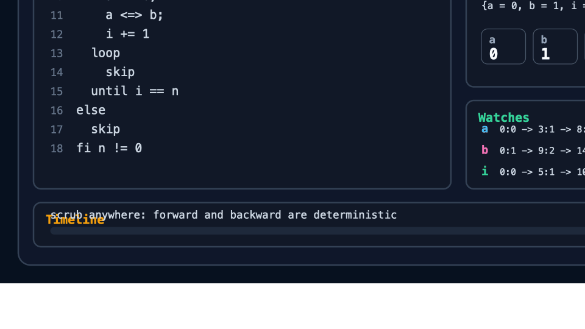

# Reverie

Reverie is a small, statically typed reversible language and audit tool.
Programs are meant to run forward and backward deterministically, so debugging
eventually becomes scrubbing execution like a video instead of reconstructing a
story from logs.

This repository implements the v1 language through **Phase 6 scrubber TUI**:
the CLI can run reversible programs forward and backward, procedures support
`call` and `uncall`, local variables use `local`/`delocal`, fixed-size arrays
and integer stacks support reversible data-structure operations, array-backed
tensors support ML-style reversible accumulation, `witness<T>` annotations mark
and measure audit/replay state, units are checked statically and erased before
runtime, refinements are checked at runtime, and the scrubber lets you move
through a state timeline.



## Why It Matters

Most execution tools tell you what happened after the fact. Reverie makes
restoration part of the program contract: a successful run can be inverted,
replayed, checked against its original inputs, and inspected step by step. That
is useful when the important question is not only "what result did I get?" but
"can I prove how this state was reached, undo it, and explain the intermediate
state changes?"

That matters for reversible algorithms, provenance-heavy data transforms,
teaching/debugging language semantics, and deterministic ML kernels where a
small model or inference result should come with replayable evidence. The
generic `roundtrip` proof path and the MNIST/Q31 audit helper both turn
execution into signed, re-verifiable artifacts instead of loose screenshots or
untrusted metrics.

## Quick Start

During development, run the CLI through Cargo:

```sh
cargo run -p reverie-cli -- <command>
```

If the binary is installed, use `reverie <command>` instead.

Check a program, run it forward, run the same source backward from the final
store, and then prove that another program restores its initial state:

```sh
cargo run -p reverie-cli -- check examples/fib.rev
cargo run -p reverie-cli -- run examples/fib.rev --var n=7 --var i=0 --var a=0 --var b=1
cargo run -p reverie-cli -- reverse examples/fib.rev --var n=7 --var i=7 --var a=13 --var b=21
cargo run -p reverie-cli -- roundtrip examples/increment.rev
```

Expected forward and reverse stores:

```text
{a = 13, b = 21, i = 7, n = 7}
{a = 0, b = 1, i = 0, n = 7}
```

Open the timeline scrubber when you want to inspect execution state by state:

```sh
cargo run -p reverie-cli -- scrub examples/fib.rev --var n=7 --var i=0 --var a=0 --var b=1
```

Use `--dump` when you want the same timeline as text for tests, docs, or CI.

## How To Use Reverie

Start with a `.rev` program from `examples/` or write a new one using the
language reference. Run `check` first so syntax, scoping, aliases, units, and
other static constraints fail before execution.

Seed top-level variables with `--var NAME=VALUE`. For larger stores, such as
arrays, tensors, model weights, or witness fixtures, use `--vars-json PATH`.
Use `--type NAME=TYPE` when a seed needs units or when an empty array needs an
explicit element type.

Use `run` for forward execution and `reverse` when you already have the final
store and want the mechanically derived inverse to restore the starting store.
Use `roundtrip` as the everyday proof command: it runs forward, immediately
runs the inverse, checks the restored store and I/O tapes, and can write a JSON
proof with `--proof-output`.

Use `invert` to review the generated inverse source, `fmt` to normalize source
files, and `explain` to summarize the reversible shape before choosing inputs.
Add `--ml` to `explain` when reviewing tensor, Q31, or witness-heavy programs.

For deterministic ML audits, use the `reverie-mnist-linear` companion binary.
It can self-test the Q31 runner, write replay bundles, verify those bundles,
export signed model artifacts, inspect individual training or inference rows,
evaluate a signed model over a sample set, and compare proof payload costs:

```sh
cargo run -p reverie-cli --bin reverie-mnist-linear -- --self-test --audit-output target/mnist-self-test-replay-bundle.json
cargo run -p reverie-cli --bin reverie-mnist-linear -- --verify-audit target/mnist-self-test-replay-bundle.json --markdown-output target/mnist-self-test-audit-verification.md
cargo run -p reverie-cli --bin reverie-mnist-linear -- --export-model target/mnist-self-test-replay-bundle.json --model-output target/mnist-self-test-model-bundle.json
cargo run -p reverie-cli --bin reverie-mnist-linear -- --inspect-inference target/mnist-self-test-replay-bundle.json --audit-step 0 --markdown-output target/mnist-self-test-inference-audit.md
```

## Workspace

- `crates/reverie-syntax`: lexer, parser, spans, and the concrete AST.
- `crates/reverie-core`: semantic checks, unit checking, and `invert()`.
- `crates/reverie-interp`: state, values, tree-walking execution, and the
  slot-compiled execution engine.
- `crates/reverie-cli`: the `reverie` binary.
- `crates/reverie-tui`: ratatui scrubber and timeline dump rendering.

## Command Catalog

The quick start above covers the usual path. The examples catalog has a deeper
guided tour with expected output for the main positive examples and a grouped
tour of the diagnostic examples: [Examples](examples/README.md).

```sh
cargo run -p reverie-cli -- check examples/skip.rev
cargo run -p reverie-cli -- run examples/skip.rev
cargo run -p reverie-cli -- run examples/fib.rev --var n=7 --var i=0 --var a=0 --var b=1
cargo run -p reverie-cli -- run examples/fib.rev --engine tree --var n=7 --var i=0 --var a=0 --var b=1
cargo run -p reverie-cli -- reverse examples/fib.rev --var n=7 --var i=7 --var a=13 --var b=21
cargo run -p reverie-cli -- roundtrip examples/increment.rev
cargo run -p reverie-cli -- roundtrip examples/reversible_inference_trace.rev --proof-output target/reversible-inference-roundtrip-proof.json
cargo run -p reverie-cli -- verify-roundtrip target/reversible-inference-roundtrip-proof.json
cargo run -p reverie-cli -- invert examples/fib.rev
cargo run -p reverie-cli -- explain examples/fib.rev
cargo run -p reverie-cli -- explain --ml examples/mnist_mlp_witness.rev
cargo run -p reverie-cli -- fmt examples/fib.rev
cargo run -p reverie-cli -- run examples/wrapping.rev --var x=9223372036854775807
cargo run -p reverie-cli -- run examples/negation.rev
cargo run -p reverie-cli -- run examples/janus_operators.rev
cargo run -p reverie-cli -- run examples/janus_optional_control.rev
cargo run -p reverie-cli -- run examples/janus_procedure_syntax.rev
cargo run -p reverie-cli -- run examples/assert.rev --var x=0 --var target=2
cargo run -p reverie-cli -- run examples/injectivized_max.rev --var x=4 --var y=9 --var swapped=0
cargo run -p reverie-cli -- run examples/assert_failure.rev --var x=0
cargo run -p reverie-cli -- run examples/loop_assertion_failure.rev --var i=0 --var n=2
cargo run -p reverie-cli -- run examples/proc.rev --var n=4
cargo run -p reverie-cli -- reverse examples/proc.rev --var n=5
cargo run -p reverie-cli -- run examples/element_args.rev --var 'xs=[0,1]'
cargo run -p reverie-cli -- reverse examples/element_args.rev --var 'xs=[1,1]'
cargo run -p reverie-cli -- run examples/increment.rev
cargo run -p reverie-cli -- reverse examples/increment.rev --var x=1 --var 'xs=[-1,1]'
cargo run -p reverie-cli -- check examples/alias_rejection.rev
cargo run -p reverie-cli -- check examples/local_shadow_rejection.rev
cargo run -p reverie-cli -- run examples/globals.rev
cargo run -p reverie-cli -- run examples/io.rev --input 7
cargo run -p reverie-cli -- run examples/array.rev --var 'xs=[10,20,30]' --var delta=5
cargo run -p reverie-cli -- reverse examples/array.rev --var 'xs=[30,25,10]' --var delta=5
cargo run -p reverie-cli -- run examples/size.rev
cargo run -p reverie-cli -- reverse examples/size.rev
cargo run -p reverie-cli -- run examples/stack.rev
cargo run -p reverie-cli -- reverse examples/stack.rev
cargo run -p reverie-cli -- run examples/janus_stack_reverse.rev
cargo run -p reverie-cli -- run examples/janus_sort.rev --var n=5 --var i=0 --var j=0 --var 'list=[5,3,4,1,2]' --var 'perm=[0,0,0,0,0]'
cargo run -p reverie-cli -- run examples/tensor_linear.rev
cargo run -p reverie-cli -- run examples/invertible_coupling.rev
cargo run -p reverie-cli -- run examples/triangular_residual.rev
cargo run -p reverie-cli -- run examples/reversible_normalize.rev
cargo run -p reverie-cli -- run examples/reversible_clamp.rev
cargo run -p reverie-cli -- run examples/reversible_pack.rev
cargo run -p reverie-cli -- check examples/mnist_identify.rev
cargo run -p reverie-cli -- check examples/mnist_reversible_step.rev
cargo run -p reverie-cli -- check examples/mnist_witness_tape.rev
cargo run -p reverie-cli -- check examples/mnist_witness_tape_loop.rev
cargo run -p reverie-cli -- check examples/mnist_mlp_witness.rev
python3 scripts/check_q31_mlp_witness.py --self-test
python3 scripts/check_q31_mlp_witness.py --vars-json target/mnist-ml-audit-pipeline-release/mlp-witness-vars.json --run-output-json target/mnist-ml-audit-pipeline-release/mlp-witness-run.json --markdown-output target/mlp-witness.md
cargo run -p reverie-cli --bin reverie-mnist-linear -- --self-test
cargo run -p reverie-cli --bin reverie-mnist-linear -- --self-test --json
cargo run -p reverie-cli --bin reverie-mnist-linear -- --self-test --audit-output target/mnist-self-test-replay-bundle.json
cargo run -p reverie-cli --bin reverie-mnist-linear -- --verify-audit target/mnist-self-test-replay-bundle.json --markdown-output target/mnist-self-test-audit-verification.md
cargo run -p reverie-cli --bin reverie-mnist-linear -- --export-model target/mnist-self-test-replay-bundle.json --model-output target/mnist-self-test-model-bundle.json
cargo run -p reverie-cli --bin reverie-mnist-linear -- --import-model-json target/q31-linear-model.json --model-output target/imported-q31-linear-model-bundle.json
cargo run -p reverie-cli --bin reverie-mnist-linear -- --verify-model target/mnist-self-test-model-bundle.json
cargo run -p reverie-cli --bin reverie-mnist-linear -- --scan-audit target/mnist-self-test-replay-bundle.json --audit-limit 5
cargo run -p reverie-cli --bin reverie-mnist-linear -- --inspect-audit target/mnist-self-test-replay-bundle.json --audit-step 0
cargo run -p reverie-cli --bin reverie-mnist-linear -- --inspect-audit target/mnist-self-test-replay-bundle.json --audit-step-strategy lowest-margin --markdown-output target/mnist-self-test-step-debug.md
cargo run -p reverie-cli --bin reverie-mnist-linear -- --inspect-audit target/mnist-self-test-replay-bundle.json --audit-step 0 --step-output target/mnist-self-test-step-bundle.json --markdown-output target/mnist-self-test-step-debug.md
cargo run -p reverie-cli --bin reverie-mnist-linear -- --verify-step target/mnist-self-test-step-bundle.json --markdown-output target/mnist-self-test-step-debug.md
cargo run -p reverie-cli --bin reverie-mnist-linear -- --inspect-inference target/mnist-self-test-replay-bundle.json --audit-step 0 --markdown-output target/mnist-self-test-inference-audit.md
cargo run -p reverie-cli --bin reverie-mnist-linear -- --inspect-inference target/mnist-self-test-replay-bundle.json --audit-step 0 --inference-output target/mnist-self-test-inference-bundle.json
cargo run -p reverie-cli --bin reverie-mnist-linear -- --verify-inference target/mnist-self-test-inference-bundle.json --markdown-output target/mnist-self-test-inference-verification.md
cargo run -p reverie-cli --bin reverie-mnist-linear -- --inspect-model-inference target/mnist-self-test-model-bundle.json --sample-audit target/mnist-self-test-replay-bundle.json --audit-step 0 --standalone-rev-output target/mnist-standalone-classifier.rev --inference-output target/mnist-self-test-model-inference-bundle.json
cargo run -p reverie-cli -- run target/mnist-standalone-classifier.rev --json > target/mnist-standalone-classifier-run.json
cargo run -p reverie-cli -- roundtrip target/mnist-standalone-classifier.rev --json --proof-output target/mnist-standalone-classifier-roundtrip.json > target/mnist-standalone-classifier-roundtrip-stdout.json
cargo run -p reverie-cli -- verify-roundtrip target/mnist-standalone-classifier-roundtrip.json --json > target/mnist-standalone-classifier-roundtrip-verification.json
python3 scripts/visualize_mnist_reverie.py --classifier-rev target/mnist-standalone-classifier.rev --inference-bundle target/mnist-self-test-model-inference-bundle.json --run-json target/mnist-standalone-classifier-run.json --roundtrip-json target/mnist-standalone-classifier-roundtrip.json --verification-json target/mnist-standalone-classifier-roundtrip-verification.json --output target/mnist-standalone-classifier-visualizer.html
python3 scripts/check_invertible_coupling.py --markdown-output target/invertible-coupling.md
python3 scripts/check_triangular_residual.py --markdown-output target/triangular-residual.md
python3 scripts/check_reversible_preprocess.py --markdown-output target/reversible-preprocess.md
python3 scripts/check_reversible_inference_trace.py --markdown-output target/reversible-inference-trace.md
python3 scripts/verify_model_capsule.py target/mnist-ml-audit-pipeline-release --require-handoff --require-verification-markdown
python3 scripts/check_ml_north_star.py target/mnist-ml-audit-pipeline-release
cargo run -p reverie-cli --bin reverie-mnist-linear -- --export-samples target/mnist-self-test-replay-bundle.json --samples-output target/mnist-samples.json
cargo run -p reverie-cli --bin reverie-mnist-linear -- --verify-samples target/mnist-samples.json
cargo run -p reverie-cli --bin reverie-mnist-linear -- --evaluate-model target/mnist-self-test-model-bundle.json --samples-json target/mnist-samples.json --evaluation-output target/mnist-evaluation-bundle.json --json
cargo run -p reverie-cli --bin reverie-mnist-linear -- --verify-evaluation target/mnist-evaluation-bundle.json
cargo run -p reverie-cli --bin reverie-mnist-linear -- --scan-evaluation target/mnist-evaluation-bundle.json --evaluation-limit 5
cargo run -p reverie-cli --bin reverie-mnist-linear -- --inspect-evaluation target/mnist-evaluation-bundle.json --evaluation-row 0 --inference-output target/mnist-evaluation-row-inference-bundle.json --markdown-output target/mnist-evaluation-row-inference-audit.md
cargo run -p reverie-cli --bin reverie-mnist-linear -- --json --compare-artifacts target/mnist-self-test-replay-bundle.json target/mnist-self-test-model-bundle.json target/mnist-samples.json target/mnist-self-test-step-bundle.json target/mnist-self-test-inference-bundle.json target/mnist-evaluation-bundle.json
cargo run -p reverie-cli -- run examples/bit_reversal.rev --var n=8 --var 'xs=[10,20,30,40,50,60,70,80]' --var 'perm=[0,4,2,6,1,5,3,7]'
cargo run -p reverie-cli -- run examples/perm_to_code.rev --var 'x=[2,0,3,1,5,4]'
cargo run -p reverie-cli -- run examples/janus_root.rev --var num=27
cargo run -p reverie-cli -- run examples/janus_factor.rev --var num=840
cargo run -p reverie-cli -- run examples/array_units.rev
cargo run -p reverie-cli -- run examples/array_oob.rev --var 'xs=[1,2,3]'
cargo run -p reverie-cli -- check examples/units.rev
cargo run -p reverie-cli -- run examples/units_exponents.rev
cargo run -p reverie-cli -- run examples/top_level_units.rev --var speed=0 --type 'speed=int<m/s>' --var distance=100 --type 'distance=int<m>' --var time=10 --type 'time=int<s>'
cargo run -p reverie-cli -- check examples/top_level_unit_mismatch.rev --type 'speed=int<m/s>' --type 'distance=int<m>'
cargo run -p reverie-cli -- check examples/unit_mismatch.rev
cargo run -p reverie-cli -- run examples/refinement.rev
cargo run -p reverie-cli -- run examples/refinement_violation.rev
cargo run -p reverie-cli -- run examples/refinement_units_loop.rev
cargo run -p reverie-cli -- run examples/refinement_units_loop_violation.rev
cargo run -p reverie-cli -- scrub examples/fib.rev --var n=7 --var i=0 --var a=0 --var b=1
cargo run -p reverie-cli -- scrub examples/fib.rev --var n=2 --var i=0 --var a=0 --var b=1 --watch a --watch i --dump
```

The MNIST audit, sample-set, step, model, inference, and evaluation bundles are
deterministic replay/provenance proofs, not just saved metrics or predictions:
they sign the model/sample/result, extracted sample lineage, or training trace,
proof payload bytes, update or attribution checks, and forward/inverse
recompute counts, and the verifiers rebuild those proofs before accepting the
artifact. Artifact comparisons include an `audit_contract` block that states
whether the collected bundles prove the reversible, inspectable, deterministic
Q31 ML kernel contract.

`check` parses and runs core semantic checks. `run` parses, checks, executes
forward, prints any `show(...)` or `printf(...)` observations, and then prints
the final store in a stable format:

```text
{a = 13, b = 21, i = 7, n = 7}
```

`reverse` runs the same source backward from a seeded final store:

```text
{a = 0, b = 1, i = 0, n = 7}
```

`roundtrip` runs forward, immediately runs the derived inverse, checks that the
initialized entry store and I/O tapes are restored, and can emit a
fingerprinted JSON proof with witness-store hashes and a signed ML profile for
tensor/Q31 kernels. `verify-roundtrip` checks a saved proof's hashes, reloads
the referenced source, reruns the roundtrip from the saved baseline, and
requires the recomputed proof fingerprint to match.
`invert` prints the mechanically derived inverse as Reverie source, which is
useful when checking that the reversible shape is the one you intended.
`fmt` prints canonical parser-compatible Reverie source for review and
normalization.
`explain` parses and checks a program, then prints a short construct summary so
you can see the reversible shape before choosing inputs. Add `--ml` for a
tensor/witness/Q31 profile that classifies model-shaped programs as general
reversible code, tensor reversible kernels, or auditable ML kernels.

The procedure/local example runs as:

```text
{n = 5}
```

and backward:

```text
{n = 4}
```

The array example runs as:

```text
{delta = 5, xs = [30, 25, 10]}
```

`scrub` opens the interactive timeline UI. Add `--dump` to print the same
timeline without entering the TUI.

The README GIF is generated from the real Fibonacci scrubber timeline:

```sh
python3 scripts/render_scrubber_gif.py
```

The checked Janus performance smoke gate is:

```sh
scripts/verify_janus_performance.py
```

It verifies the full configured Janus/Reverie benchmark corpus, requires every
workload to clear the current median speedup gate, requires the slowest
observed workload, suite median, and geometric mean to clear their aggregate
speedup floors, and writes
`benchmarks/results/jana-vs-reverie-smoke.json` plus
`benchmarks/results/jana-vs-reverie-smoke.md`.

## Docs

- [Example programs](examples/README.md)
- [Language reference](docs/language.md)
- [Grammar reference](docs/grammar.md)
- [CLI reference](docs/cli.md)
- [Model import](docs/model-import.md)
- [V1 acceptance audit](docs/v1-acceptance.md)
- [Evaluation](docs/evaluation.md)
- [Performance](docs/performance.md)
- [Benchmarks](benchmarks/README.md)
- [Janus compatibility](docs/janus-compatibility.md)
- [Janus compatibility audit](docs/janus-audit.md)
- [Architecture](docs/architecture.md)
- [Diagnostics](docs/diagnostics.md)
- [Reversibility and oracle testing](docs/reversibility.md)
- [Injectivization](docs/injectivization.md)
- [Arrays](docs/arrays.md)
- [Units of measure](docs/units.md)
- [Refinements](docs/refinements.md)
- [Scrubber TUI](docs/scrubber.md)
- [Roadmap](docs/roadmap.md)

## Phase 1 Semantics

- `int` is signed `i64`.
- Integer arithmetic uses two's-complement wrapping semantics.
- Top-level variables are supplied externally; scoped temporaries use
  `local`/`delocal`.
- CLI/tests will seed state with values such as:

```sh
--var n=7 --var i=0 --var a=0 --var b=1
```

The Phase 1 Fibonacci target is a reversible pair transform. With initial
state `n = 7, i = 0, a = 0, b = 1`, the final state should be
`i = 7, a = 13, b = 21`.

The intended Phase 1 source is:

```rev
if n != 0 then
  from i == 0 do
    a += b;
    a <=> b;
    i += 1
  loop
    skip
  until i == n
else
  skip
fi n != 0
```

`fib.rev`, `wrapping.rev`, `negation.rev`, `bool_toggle.rev`,
`bool_flags.rev`, `janus_operators.rev`,
`janus_optional_control.rev`, `janus_procedure_syntax.rev`, `assert.rev`,
`injectivized_max.rev`, `proc.rev`, `element_args.rev`, `increment.rev`, `globals.rev`,
`io.rev`, `array.rev`, `size.rev`, `stack.rev`, `janus_stack_reverse.rev`,
`janus_sort.rev`, `bit_reversal.rev`, `perm_to_code.rev`, `janus_root.rev`,
and `janus_factor.rev` are executable both forward and backward.
`alias_rejection.rev` and `local_shadow_rejection.rev` document the v1
no-alias/no-shadow scoping model.
`static_array_bounds.rev` shows shape-aware static rejection of a literal
out-of-bounds array index through nested procedure calls. The same checker also
folds constant integer index expressions and constant zero divisors before
runtime.
`loop_assertion_failure.rev` is a negative runtime example for the reversible
loop entry/re-entry invariant.
`assert_failure.rev` is a negative runtime example for standalone Janus-style
assertions.
`array_oob.rev` is a negative runtime example with a span-aware diagnostic.
`proc_runtime_error.rev` is a negative procedure example that reports both the
failing expression and the call site.
`units.rev`, `units_exponents.rev`, and `top_level_units.rev` show
compile-time dimensions, and the unit mismatch examples are rejected by
`reverie check`.
`refinement.rev` shows runtime-checked predicates, and
`refinement_violation.rev` is a negative example that `reverie run` rejects.
`refinement_units_loop.rev` and its negative companion show refinements over
unitful values inside reversible loops.

## Verification

```sh
cargo fmt --check
python3 scripts/check_materialized_sources.py
cargo clippy --workspace --all-targets -- -D warnings
cargo test --workspace
cargo bench -p reverie-interp --bench execution
scripts/bench_jana_vs_reverie.py --runs 20 --warmup 3
```

`check_materialized_sources.py` is a local preflight for macOS/iCloud working
trees: it reports APFS dataless placeholders before broad Cargo test runs block
while reading examples or manifests. It ignores `*.dataless-quarantine-*`
files by default so archived unreadable originals do not block active source
verification; pass `--include-quarantine` when you want to audit those
quarantined files too.
